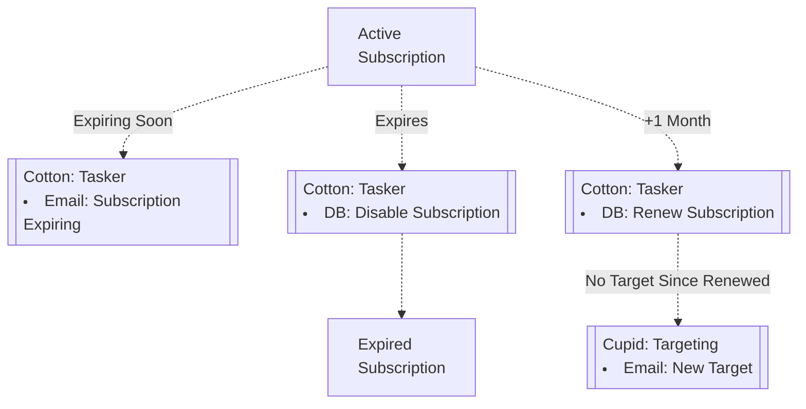
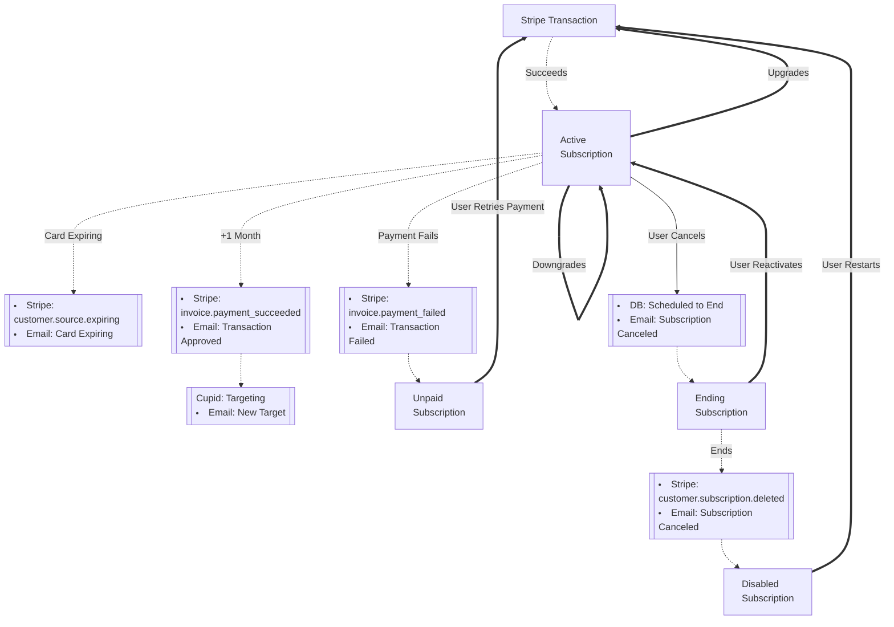
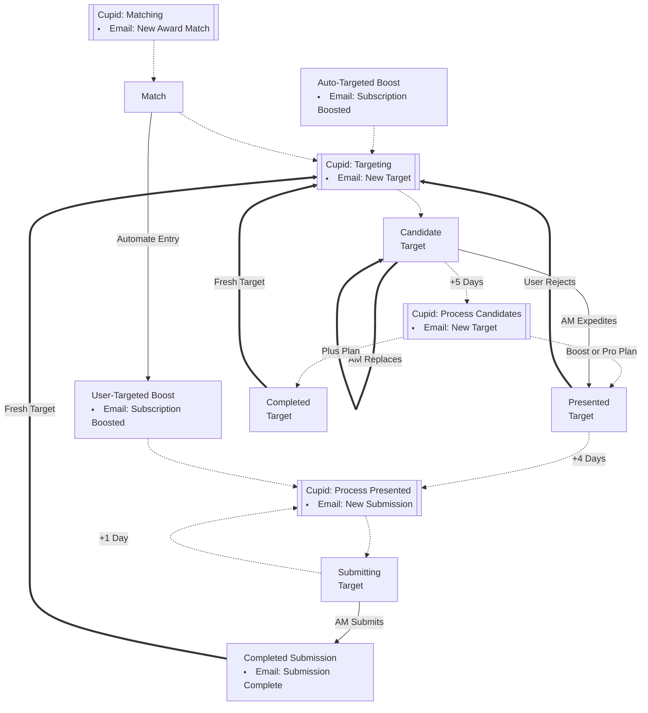

# Cotton

The api server for bookawardpro.com

Any interesting task should be codified in a Makefile target. See `make help`
for a list of such targets.


## Node.js
## PostgreSQL
## Sequelize ORM
## Docker
## GitLab CI


[[_TOC_]]


## Docs

### Life of a Subscription

#### Enterprise Partners

Currently, all subscriptions for enterprise partners are non-recurring, renewed
monthly by Cotton and billed manually.



#### Direct Partners

Currently, all subscriptions for direct partners are recurring, renewed monthly by Stripe.



#### State Changes

The table below attempts to summarize the various actions that a customer can
perform that change the state of a subscription in a substantial way. NOTE: Only
these actions are supported for non-recurring subscriptions: Migrate.

| Action     | Endpoint                                | Availability               | Comments                                             |
|------------|-----------------------------------------|----------------------------|------------------------------------------------------|
| Signup     | POST /signup                            |                            | performs new customer tasks as well                  |
| Add        | POST /subscriptions                     |                            |                                                      |
| Cancel     | POST /subscriptions/:id/cancel          | enabled                    | schedules subscription to end, enabled until then    |
| Reactivate | POST /subscriptions/:id/reactivate      | enabled & canceled         | uncancels subscription before it ends                |
| Switch     | PUT /subscriptions/:id                  | enabled                    | does not create a new BAP subscription               |
| Migrate    | DELETE /subscriptions/:old/migrate/:new | disabled & canceled        | tombstones the old one                               |
| Restart    | POST /subscriptions/:id/restart         | disabled & canceled & book | akin to Add then Migrate old one                     |
| Retry      | POST /subscriptions/:id/retry           | disabled & unpaid          | no new BAP nor Stripe subscription, just get it paid |

### Life of a Match

- When a user rejects the presented target, the match stays as a rejected match.
  This is to ensure that won't be targeted again as well as communicate that
  target was rejected by the user.
- When an AM replaces a candidate target, the match is removed. In other words,
  it goes back into the landscape as a potential match or target in the future.
  Everything but the award is copied over to the new candidate. This preserves
  things like target & to-submit timing.
- A Submitting Target is a Completed Target (targeting=complete) with submitBy
  defined to signal when a submission should be started.



### Scoring Rules

* Include the sum of the award Rating fields from Airtable

* *OR Keywords*: add all of these up:
    - 4 points for each matching OR1 keyword
    - Double the OR1 score if book matches all the OR1 keywords
    - 4 points for each matching OR2 keyword
    - Double the OR2 score if book matches all the OR2 keywords

* *AND Keywords*: 21 points for each matching AND keyword

* *OR Work Types*: 11 points for each "Work Types (OR)" match

* *AND Work Types*: 16 points for each "Work Types (AND)" match

* *Preferred Keyword*: 16 points if any profile keyword is in our preferred keywords list:

* *Regions*: 20 point bonus if any regional match (book setting, author birth/residence/citizen/lineage)
    - Regional matches should be stronger than general matches
    - No extra bonus for multiple regional matches

* *Penalty*: Currently there are none, but we used that before for the likes of Pinnacle & Literary Titan to give other awards more of a chance.

* *Digital*: 20 points if the award accepts digital submissions

* *Fee*: Effective entry fee bonus (uses our pricing when defined):
    - 10 points if less than 75
    - 6 points if less than 100
    - 3 points if less than 150

* *Website*: 10 point penalty if award website field in Airtable is empty
    - There are not currently any awards in our DB without a website, but leaving in case

* DISABLED: -10 point penalty if award has no due date
    - The idea is to move those slightly behind equally-scored awards that are due sooner

* *Due Date*: bonus so that infrequent awards (cycles < 4 per year) that are due sooner score higher:
    - Bonus calculation is:  (60 - $days_until_due) / 2
    - Example award due in 3 days:  (60 - 3) / 2 = 28.5 = 29 points
    - Example award due in 32 days:  (60 - 32) / 2 = 14 points

* *Cycles*: Penalize very frequent awards, so infrequent gets targeted when they come up
    - 5 point penalty if award has 2 cycles per year
    - 14 point penalty if award has 3 cycles per year
    - 44 point penalty if award has 4 cycles per year
    - 66 point penalty if award has 5+ cycles per year

* *Quick Draw*: a bonus for awards which do not take forever to announce results:
    - 10 point bonus if the award announces results within 45 days after the due date
    - 5 point bonus if the award announces results within 90 days after the due date

* *Non-Content Type*: 80 point penalty if award has any non-content type

* *Generic*: 41 point penalty if award category is in our general/generic regex pattern:
    - /^(?:general|(?:non)?fiction|miscellaneous|crossgenre|wildcard|other|ebook|novel|generalinterest|audio(book|drama)s?|oftheyear)+$/

* *Won Cousin*: 80 point penalty if award was won in any category, in any cycle

* *Submit Twin*: 80 point penalty if award was submitted in the same category, in any previous cycle

* *Submit Sibling*: 60 point penalty if award was submitted in any category, in the current cycle

* *Submit Cousin*: 51 point penalty if award was submitted in any category, in any previous cycle

* *Target Cousin*: 41 point penalty if award was targeted in any category, in any cycle, in past 180 days

* *Frequent Due Soon*: 100 point penalty if all conditions are met:
    - frequent (cycles > 3 per year)
    - due within 12 days
    - already matched against award this cycle in any category

### Affiliates & Referrals

Every non-enterprise sub-account can be an affiliate and refer others by adding `?ssa=${affiliate.code}` to our urls.  All public pages will detect this parameter, update a `share_code` cookie, and then redirect the user to the affiliate's url (defaults to https://bookawardpro.com).  If a user happens to visit our site with different affiliate codes, the latter one will win.

Currently, commission is earned on only the first subscription for each new account.  Boosts DO NOT earn commission.  Additional subscriptions DO NOT earn commission.  Commission is determined by the actual price paid, so if someone uses a coupon, we pay commission based on the final amount paid.

On the first day of each month, a scheduled job will process all pending referrals, credit Stripe account balances, and email the team a report for settling PayPal commissions manually.  While there is support for paying referral commission via PayPal, there is no way for users to manage that themselves.  The default is to be paid via service credit.

The affiliate's account will receive a "Referral Credit" notification when someone signs up using their affiliate code.  There currently is no notification to affiliates when commissions are paid.

These models are used to govern and track referrals:

- Affiliate: Contains the details that govern when & how to pay Referrals.  Has a 1:1 relationship to User.

- Referral: Represents an intent to pay a Commission, assuming criteria met at time to pay (eg subscription active and age > 33 days). The only state transitions are from pending->paid or pending->rejected. After those transitions, a Referral is immutable.  Has a 1:1 relationship to the Subscription that the referral is for and a 1:* relationship with Affiliate.

- Commission: An immutable record that a Referral was paid.  Has a 1:1 relationship to Referral.

NOTE: Affiliate contains unused columns (days, recurring, subscriptions) that might be used for possible future scenarios such as paying commission on:

- first N-months of the initial plan
- first N-months for all plans the referee purchases
- first paid (non-free) plan purchased within the first N-months


## Development

Before running `make dev` for the first time, the following dependencies will be needed:

- a postgres 13 server
- the `yarn` & `bunyan` utilities - can be installed via `npm install -g yarn bunyan`
- a `.env` file - see "Environment" below

### Build & Deploy

See `build` & `publish` make targets.  Docker is the recommended & supported method.

### Running Tests

See `test` & `test-email` make targets.


## Tasks

The api does double duty as a task/job processor. Some day this should be
handled by something better equipped such as [BullMQ](https://docs.bullmq.io/what-is-bullmq).


## Development

### Environment

The following is a sample .env file for local development.  Substitute `TODO` as needed.

    LOG_LEVEL=info
    API_PORT=3001
    FRONTEND=http://localhost:3000
    NODE_ENV=development
    TASKER_DISABLED=
    MAILER_DISABLED=
    MAIL_SHUNT= (your email address)
    AWARDS_MASTERS=
    UPLOADS_DIR=/tmp/uploads

    STRIPE_KEY=          # for accessing stripe data (cards, subscriptions)
    STRIPE_WEBHOOK_SECRET= # for responding to webhooks, not typically needed for dev
    POSTMARK_KEY=                # for sending email
    MAILCHIMP_KEY=               # for subscribing new signups to our mailing list
    ISBNDB_KEY=                  # for getting book metadata
    SESSION_KEY=             # for login sessions

    S3_ENDPOINT=https://.com
    S3_BUCKET=bap-test
    S3_ACCESS_ID=
    S3_ACCESS_KEY=

    PGHOST=localhost
    PGPORT=5432
    PGNAME=
    PGUSER= (your username)
    PGSSLMODE=
    TZ=

### Manual Testing

If would like to use a command-line tool (eg curl, httpie) or something like
Postman to make requests to the api, you will need to authenticate and store the
session cookie. Here is an example using httpie:

```bash
# http POST :3001/login username= password='HiMom!' --print=h --session=api
HTTP/1.1 200 OK
...
Set-Cookie: connect.sid=; Path=/; Expires=Fri, 29 Apr 2022 17:52:02 GMT; HttpOnly

# jq -r '.cookies["connect.sid"].value' ~/.httpie/sessions/localhost_3001/api.json


# http --session=api :3001/session | jq -r .email

```